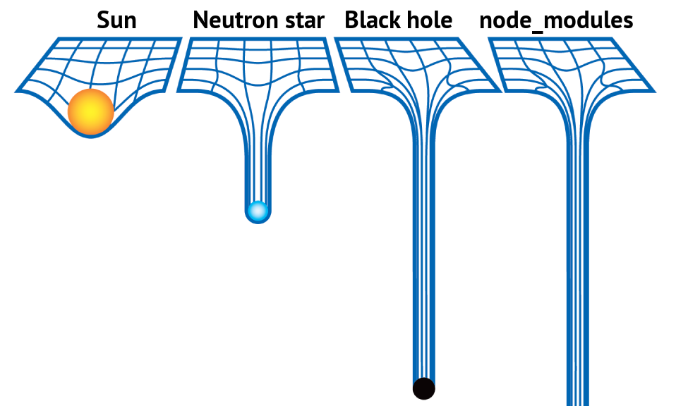

# Developing using Vue

```
vue serve App.vue
```

As usual, Derrick taught me this. Vue is a UI **framework**, which provides foundation for software developers to build web programs. While this is the general definition of a framework, I'm not too sure how a UI framework is distinct from this definition, but I guess I'll learn as I go.

**how is this diff from gcc**
vue serve app.vue preprocesses ???

gcc is compiler
run the outputed binary filename.o

we use vue (UI framework)

# Things I should prob use

## Props

"Child components are like functions, and props are like arguments. Can use props to pass stuff"

[an example](https://vuejs.org/v2/guide/components.html#Passing-Data-to-Child-Components-with-Props)

## Parent-Child Components

In the early stages of my project, I was confused about everything that was going on and I couldn't describe my questions without really circumstantial questions regarding my code with screenshots. Derrick articulated my question best:

> The checkbox is in Friend component but you want to have a list of what's checked in the FriendList parent component?

The reason why my code didn't work was because **props** are for passing data only from parent to child, so if you want to pass it the other way, in Vue, you [emit events](https://vuejs.org/v2/guide/components.html#Listening-to-Child-Components-Events).

Derrick explains colloquially that

> "something" can emit events and another part of your code can listen for those events and run stuff based on those events.
> So parent waits for x to happen, then when you, for example, click a child, it yells "I got clicked!" and parent hears it and runs some code

### Documentation of the instance of emitting in my project (:

I'm super proud of when I finally learned how to allow the parent component to listen for a response from the child component!

In this super clear example of how to [emit child events](https://vuejs.org/v2/guide/components.html#Listening-to-Child-Components-Events), one thing I was a little confused about was which code snippets belonged in the parent and child components. So first, I'd like to clarify that code snippets 1, 2, and 4 are in the parent components. Code snippets 3 and 5, the ones relating to the `<button> Enlarge text </button>` and `$emit` are in Child.

#### explaining the example

To summarize what the example in the Vue docs illustrates, you need to do 4 things to enable the parent component to listen for child events:

1. a data property in the Vue component declaration to store the information you're listening for from the Child component (this is `postFontSize` from code snippet 1 from the Vue docs example)
   - located in parent component, written in [java]`<script>`
2. specify using the data property you declared, where this information will be presented in the template (code snippet 2)
3. Use the `v-on` directive while calling the child to listen for an event in child (in this case, when the button is pressed), and run some Javascript (which is to increment `postFontSize`) when the child is triggered. (an example of this is in code snippet 4)
   - both this and #2 are in the parent component, in the `<template>` section
4. Include `v-on:...="$emit('...')"` in the HTML element that will communicate a user's response back to the parent (code snippet 5)
   - located in the child component

#### Emitting (obsolete but simple ex. nonetheless)

Long after this project is over, I might forget how exactly I emitted information from the Child component back to the parent, so I'll show code snippets of my code as examples for each of the numbered parts I explained in the section above.

1. Variable declaration `selectedFriends` in the Vue component that will store the results of what we're listening for in the Child component. [link to repo](https://github.com/Felicious/Boba-Bill-2/blob/8c0cca3576cbcfc39bdab9551978fb3a9a3e40fe/components/FriendList.vue#L50)

```js
export default {
  components: {
    InputText,
    Friend
  },
  data() {
    return {
      ... ,
      selectedFriends: []
    };
  },
  methods: {
    ...
  }
};
```

2. Where the results of the response from the Child component will be displayed. [link](https://github.com/Felicious/Boba-Bill-2/blob/8c0cca3576cbcfc39bdab9551978fb3a9a3e40fe/components/FriendList.vue#L22)

```html
<p>{{ selectedFriends }}</p>
```

3. The `FriendList` component listens for `select-friend` events from its children `Friend` and runs the provided event handler `"selectedFriends.push(friend.text)"` when it receives a `select-friend` event. [link](https://github.com/Felicious/Boba-Bill-2/blob/8c0cca3576cbcfc39bdab9551978fb3a9a3e40fe/components/FriendList.vue#L20)

```html
<Friend
  v-for="friend in friends"
  :key="friend.id"
  :name="friend"
  v-on:select-friend="checkboxHandler(friend)"
/>
```

4. Inside the Child component, the `v-on` listener will notify the parent in the event of a `select-friend`-- which occurs when the checkbox is clicked. [link to repo](https://github.com/Felicious/Boba-Bill-2/blob/8c0cca3576cbcfc39bdab9551978fb3a9a3e40fe/components/Friend.vue#L5)

```html
<input type="checkbox" id="checkbox" v-on:click="$emit('select-friend')" />
```

5. Then, in a class method (which is called by `v-on` modifier in parent), I saved the names of the friends who were checked in this array called `selectedFriends` using this method:

```js
/* @param: instance of friend; {id: someNum, text: "name"}
     * returns: name of friend added/removed from selectedFriends list
     */
    checkboxHandler(friend) {
      // if name is in list, remove name
      if (this.selectedFriends.find(element => element === friend.text)) {
        /* why is it so complicated to remove an item from an array?
          splice requires 1) index of thing you're removing
          2) num of things you're removing*/
        this.selectedFriends.splice(
          this.selectedFriends.indexOf(friend.text),
          1
        );
      } else {
        this.selectedFriends.push(friend.text);
      }
    }
```

#### 2 way binding by emitting

Problem: I had trouble emitting responses to a checkbox because, as u see above, I had to write a function to both save and remove the name from the array, and I felt like Vue should have a way to do all of this easier. This [StackOverFlow post](https://stackoverflow.com/questions/62429355/check-uncheck-a-checkbox-in-a-child-component-with-vuejs) explained that I could achieve this behavior by using the `sync` modifier by achieving a 2-way binding on the parent and child components by using emitting.

### TODO: give example and explantion from own code

## data as a function?

In the parent(?) definition of the Vue component, [data must be returned as a function](https://vuejs.org/v2/guide/components.html#data-Must-Be-a-Function) so that both the parent and child instances can retain an independent copy of the returned data object.

## The importance of gitignore

node_modules are build packages generated by Vue for my project and can grow to an **astronomical** size, hence this joke shared by Derrick:


Therefore, it's important to include node_modules in your .gitignore file, but if you already committed the node_modules file before adding the .gitignore, you need to untrack the directory and remove it from git, while keeping the file
`git rm -r --cached node_modules`
